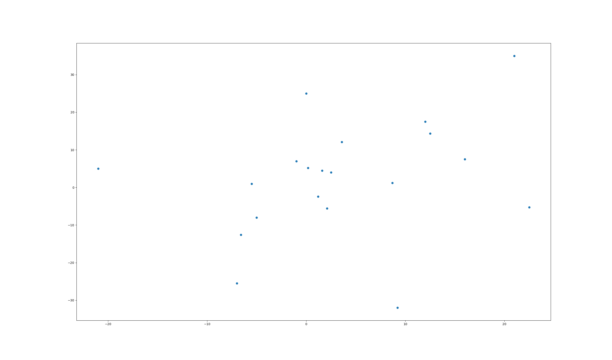

## 蚁群算法实验————解决TSP问题

> 本报告使用蚁群算法解决TSP问题

### 1. 实验背景

旅行商问题，即TSP问题（Traveling Salesman Problem），也叫旅行推销员问题、货郎担问题，是数学领域中著名问题之一。假设有一个旅行商人要拜访n个城市，他必须选择所要走的路径，路径的限制是每个城市只能拜访一次，而且最后要回到原来出发的城市。路径的选择目标是要求得的路径路程为所有路径之中的最小值。

旅行推销员问题是图论中最著名的问题之一，即“已给一个n个点的完全图，每条边都有一个长度，求总长度最短的经过每个顶点正好一次的封闭回路”。Edmonds，Cook和Karp等人发现，这批难题有一个值得注意的性质，对其中一个问题存在有效算法时，每个问题都会有有效算法。

迄今为止，这类问题中没有一个找到有效算法。倾向于接受NP完全问题（NP-Complete或NPC）和NP难题（NP-Hard或NPH）不存在有效算法这一猜想，认为这类问题的大型实例不能用精确算法求解，必须寻求这类问题的有效的近似算法。

### 2. 蚁群算法

#### 2.1 蚁群算法简介
蚁群系统(Ant System或Ant Colony System)是由意大利学者Dorigo、Maniezzo等人于20世纪90年代首先提出来的。他们在研究蚂蚁觅食的过程中，发现单个蚂蚁的行为比较简单，但是蚁群整体却可以体现一些智能的行为。例如蚁群可以在不同的环境下，寻找最短到达食物源的路径。这是因为蚁群内的蚂蚁可以通过某种信息机制实现信息的传递。后又经进一步研究发现，蚂蚁会在其经过的路径上释放一种可以称之为“信息素”的物质，蚁群内的蚂蚁对“信息素”具有感知能力，它们会沿着“信息素”浓度较高路径行走，而每只路过的蚂蚁都会在路上留下“信息素”，这就形成一种类似正反馈的机制，这样经过一段时间后，整个蚁群就会沿着最短路径到达食物源了。

将蚁群算法应用于解决优化问题的基本思路为：用蚂蚁的行走路径表示待优化问题的可行解，整个蚂蚁群体的所有路径构成待优化问题的解空间。路径较短的蚂蚁释放的信息素量较多，随着时间的推进，较短的路径上累积的信息素浓度逐渐增高，选择该路径的蚂蚁个数也愈来愈多。最终，整个蚂蚁会在正反馈的作用下集中到最佳的路径上，此时对应的便是待优化问题的最优解。

#### 2.2 蚁群算法结合TSP

控制蚁群算法走向的关键是信息素，信息素类似遗传算法的适应性函数，类似退火算法的评价函数，影响着其中一只蚂蚁的下一步的选择。

1. 蚂蚁：类似遗传算法的染色体，就是一条解，在tsp问题中蚂蚁的路径就是tsp的解。
2. 信息素：评价函数，与路径成反比
3. 蚂蚁数量：一次迭代有多少只蚂蚁在跑（注意不是一起跑，而是先后放上一只蚂蚁）
4. 迭代次数T：所有蚂蚁跑完视为一次迭代周期。

### 3. 算法设计流程

#### 3.1 算法流程图
@import "ACO.png"

#### 3.2 算法实现过程
使用python3作为设计语言，其中本次使用的版本是python3.6，其中使用了常规的的库有：
1. time
2. copy
3. random
4. math

使用的非内置库有：
1. numpy
2. matplotlib

##### 3.2.1 算法公式
> 在算法中使用的中重要公式有：
> 1. 计算信息量
> 2. 信息量更新

###### 3.2.1.1 计算信息量
计算信息量
$$P_{ij}^k(t) = \frac{\tau_{ij}^\alpha(t)\eta_{ij}^{\beta}(t)}{\sum_{l \in A_k}\tau_{il}^\alpha(t)\eta_{il}^{\beta}(t)}$$
其中:
1. $P_{ij}^k$表示蚂蚁选择的概率
2. $A_k$第k个蚂蚁的可到达集合
3. $\eta_{ij} = \frac{1}{d_{ij}}$,$d_{ij}$表示图上两点距离
4. $\tau_{ij}$表示信息素

###### 3.2.1.2 信息量更新
信息量的更新
1. 信息量计算
$$\tau_{ij}(t+n) = (1 - \rho)\tau_{ij}(t) + \Delta\tau_{ij}(t)$$
2. 蚂蚁提供的信息量
$$\Delta\tau_{ij}(t) = \sum_{k=1}^{M}\Delta\tau_{ij}^k(t)$$

##### 3.2.2 算法设计
1. 图类
首先给出一个单点的类：
```py
class Point:
    def __init__(self,x,y):
        self.x = x
        self.y = y
```

再给出图的类，保存所有的点，对于每个序列可以判断结果
```py
class Graph:
    def __init__(self,n):
        self.points = []
        self.point_n = n
    
    def add_point(self,p):
        self.points.append(p)
        self.point_n += 1
    
    def ask_distance(self,i,j):
        point_x = self.points[i]
        point_y = self.points[j]
        return math.sqrt(sqr(point_x.x - point_y.x) + sqr(point_x.y - point_y.y))

    def ask_distance_for_plan(self,plan):
        res = 0.0
        for i in range(1,self.point_n):
            res += self.ask_distance(plan[i],plan[i-1])
        res += self.ask_distance(plan[0],plan[self.point_n-1])
        return res

    def show(self):
        for item in self.points:
            print(item.x," ",item.y)
```

2. 单体蚂蚁设计
每个单体蚂蚁需要有如下属性：
> 1. 当前所在城市
> 2. 走过的路径
> 3. 已经走过的路径的个数

对应的python代码是：
```py
class Ant:
    def __init__(self,cur_city,city_n):
        self.city = cur_city
        self.tabu_table = [0 for i in range(city_n)]
        self.tabu_table[self.city] = 1
        self.city_cnt = 1
```

3. 算法实例类
最核心的部分就是`run()`方法，是整个算法的主题

根据前面给出的流程图，同时还需要初始化函数。

首先定义一些重要的常数：
```py
def __init__(self,ant_n,max_time):
    self.MAX_TIME = max_time
    self.ant_n = ant_n
    self.alpha = DEFAULT_ALPHA
    self.beta = DEFAULT_BETA
    self.rou = DEFAULT_ROU
    self.Q = DEFAULT_Q
```
其中
* MAX_TIME是最大迭代次数
* ant_n 是蚁群数量
* alpha,beta是幂次常数
* rou是信息量留存率
* Q是蚂蚁信息量流动

**注意：使用的是蚁密模型，所以Q不变化**

随后进行蚁群的初始化，对于每一个蚂蚁随机其位置
```py
def init_ants(self,city_n):
    random.seed(time.time())
    ants = []
    for i in range(self.ant_n):
        ants.append(Ant(random.randint(0,city_n-1),city_n))
    return ants
```

随后初始化信息量,初始所有信息量为1.0
```py
def init_info(self,n):
    info = [[1.0 for i in range(n)] for i in range(n)]
    return info
```

最后就是算法实体了，给出核心代码，算法细节参见其中的注释
```py
def run(self,n,graph):
    random.seed(time.time())
    
    # 初始化参数
    city_n = n
    i_time = 0
    info = self.init_info(n)
    new_info = copy.copy(info)
    ants = self.init_ants(n)

    init_plan = [i for i in range(city_n)]
    better_res = {
            "fitness": graph.ask_distance_for_plan(init_plan),
            "plan": init_plan
        }
    # 迭代开始
    print("start algorithm")

    while i_time < self.MAX_TIME:
        info = copy.copy(new_info)
        
        # 对于每一个城市的连接，进行信息衰减
        for i in range(city_n):
            for j in range(city_n):
                if i == j:
                    continue
                else:
                    new_info[i][j] *= (1 - self.rou)
        
        # 对于每一只蚂蚁个体进行操作
        for ant in ants:
            city_i = ant.city
            p_max = 0.0
            city_max = city_i
            
            for city in range(city_n):
                # 查看每个城市这只蚂蚁是否还可以继续走
                if ant.tabu_table[city] != 0:
                    continue
                else:
                    # 根据公式进行计算新的出发概率
                    # 记录概率最大的路径
                    p = math.pow(info[city_i][city],self.alpha)
                    p *= math.pow((1.0 / graph.ask_distance(city_i,city)),self.beta)
                    if p_max < p:
                        p_max = p
                        city_max = city
            
            # 将这只蚂蚁进行实际的行走，并改变这条路的信息量
            new_info[city_i][city_max] += self.Q
            ant.city_cnt += 1
            ant.tabu_table[city_max] = ant.city_cnt
            ant.city = city_max


            if ant.city_cnt == city_n:
                print(ant.city)
                print(ant.tabu_table)
                plan = []
                for i in range(city_n):
                    for j in range(city_n):
                        if i + 1 == ant.tabu_table[j]:
                            plan.append(j)
                            break
                # 如果当前蚂蚁走完了所有的道路，那么统计以此大难
                if better_res["fitness"] > graph.ask_distance_for_plan(plan):
                    better_res["fitness"] = graph.ask_distance_for_plan(plan)
                    better_res["plan"] = copy.copy(plan)
        
        # 迭代次数+1
        i_time += 1
    
    # 最终输出最好的解
    print(better_res)
```
### 4. 实验结果

#### 4.1 实验数据
使用的实验数据如下：
给出所有点的坐标
```txt
A 2.5 4.0
B 1.2 -2.4
C 8.7 1.2
D 3.6 12.1
E -5.5 0.94
F -6.6 -12.6
G 0.18 5.219
H 12.5 14.3609
I 22.5 -5.26
J 1.61 4.5
K 2.1 -5.6
L 0 25
M 9.2 -32
N -1 7
O -5 -8
P 21 35
Q 16 7.5
R -21 5
S -7 -25.5
T 12 17.5
```

给出读入数据的python代码：
```py
graph = Graph(0)
with open("in.txt","r") as f:
    lines = f.readlines()
    for line in lines:
        line = str(line)
        # print(line)
        items = line.split(' ')
        x = float(items[1])
        y = float(items[2])
        # print('x =',x,' y = ',y)
        graph.add_point(Point(x,y))
```

给出一个简单的图：


#### 4.2 实验结果展示
使用代码进行运算之后，给出的方案如下：

方案图：
@import "ACO_res.png"

方案结果：
plan 属性就是行走的序列
```py
{'fitness': 236.00533690946466
 'plan': [7, 19, 3, 13, 6, 9, 0, 1, 10, 14, 5, 18, 12, 8, 16, 2, 4, 17, 11, 15]}
```

在蚂蚁群体为1000，迭代次数为2000的时候，运行时间大概是7.311997413635254s，（时间不包括构建图的时间）

最终运行结果统计：考虑到随机性，这个时候多次运行就是必要的了。我们随机20次之后，平均的结果是：232.55980133891256

#### 4.2 实验结果分析
##### 4.2.1 稳定性
在多次运行的情况下的结果：
在这个情况下：
```py
aco = ACO(100,2000)
```

运行结果是（由于是组合问题，从而是同样的问题）：
```
236.00533690946466
236.00533690946466 
236.00533690946466 
232.5598013389125 
232.5598013389125 
232.5598013389125 
240.61174671394733 
232.5598013389125 
239.12791725285265 
232.5598013389125 
232.5598013389125 
232.5598013389125 
236.00533690946466 
232.5598013389125 
237.101406422663 
232.5598013389125 
232.5598013389125 
232.5598013389125 
232.5598013389125 
232.5598013389125
```

可以看到最终的结果是非常稳定的

##### 4.2.2 敏感性
1. 修改蚁群数量最终的结果：
尝试了如下个数的蚁群：
```py
ant_n = [1,5,10,50,80,100,150,200,300,500,600,750,800,900,1000]
```
@import "ACO_ANTN.png"

2. 修改迭代次数
尝试了如下几种可能性：
```py
max_times = [1,5,10,50,80,100,150,200,300,500,600,750,800,900,1000]
```
@import "ACO_MAXTIME.png"
